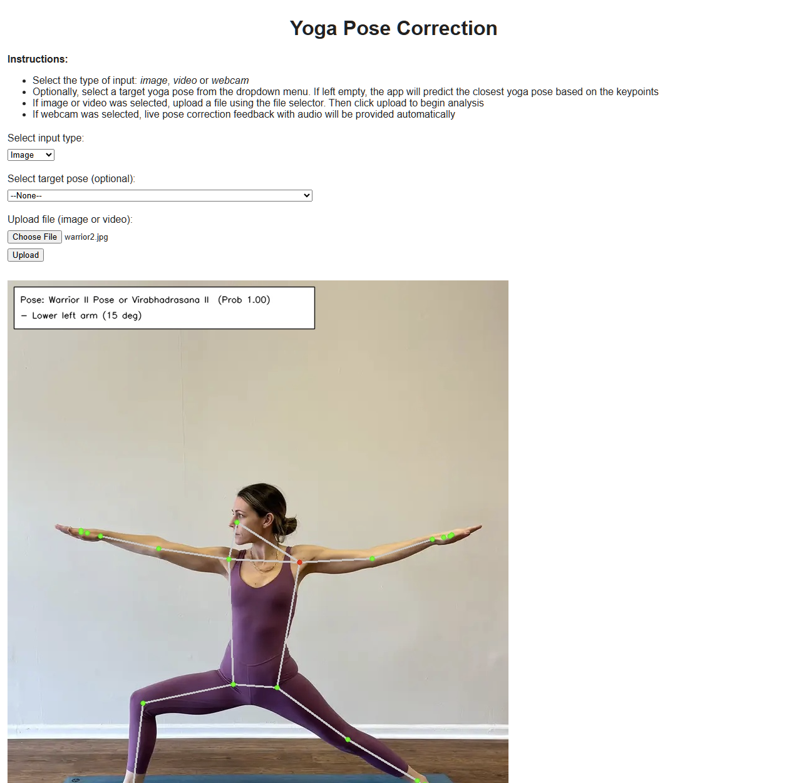
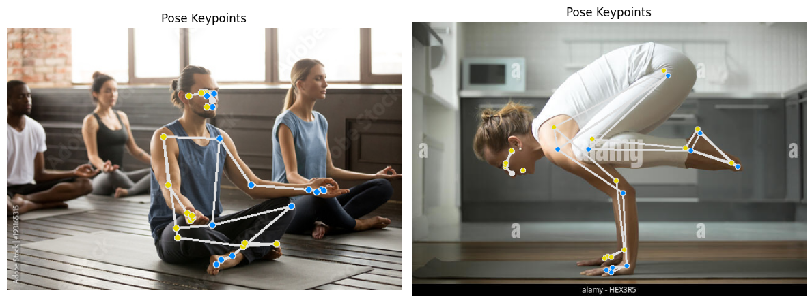
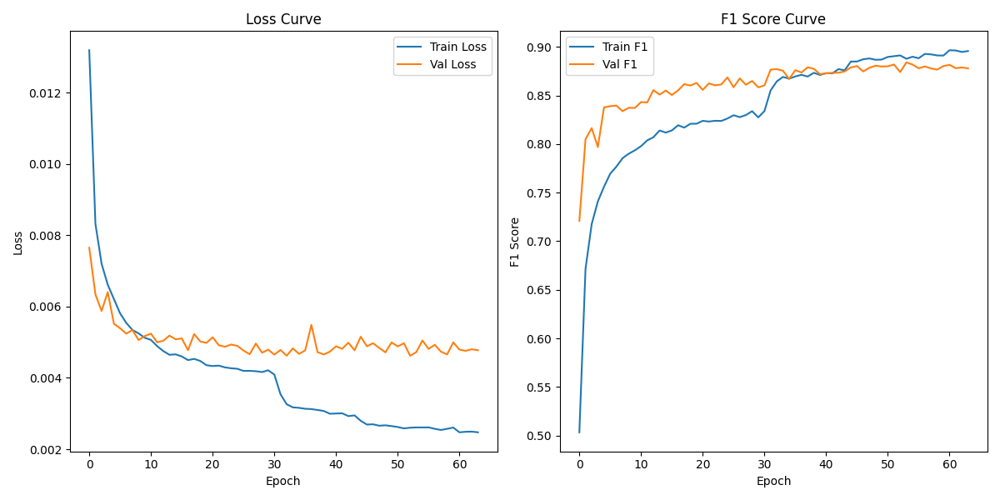
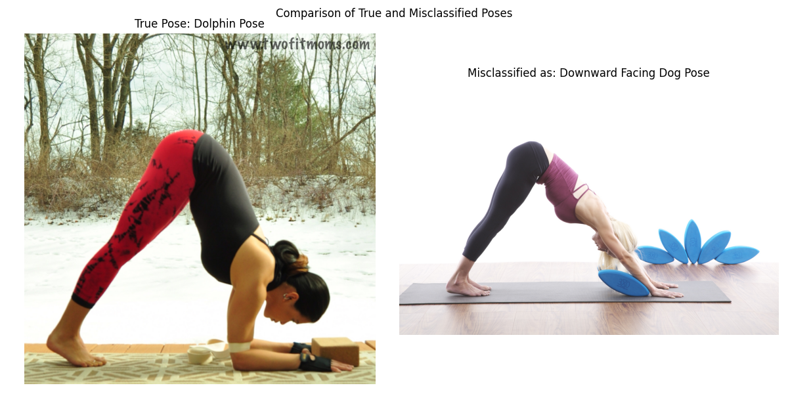
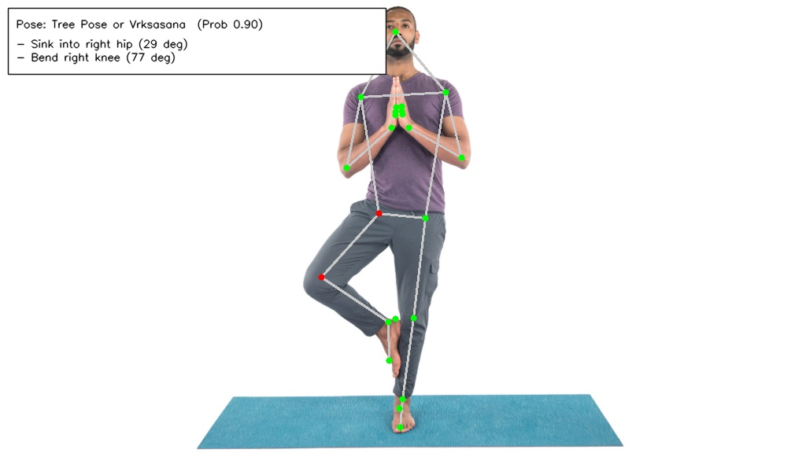

# Real-Time Yoga Pose Correction App

This is a real-time yoga pose correction app that detects key body joints and provides feedback for pose correction. The app supports both webcam streaming and file uploads (image/video)

The app features a pipeline that extracts a user's keypoints using MediaPipe and predicts the target pose using a feedforward neural network. These keypoints are then compared against reference angles of key joints for the pose, generating visual and spoken corrections for the user

The app includes a FastAPI backend using REST APIs, a lightweight HTML/JS frontend and asynchronous audio feedback using Edge TTS. It uses GitLab CI for continuous integration and is built for local deployment 

## Table of Contents

- [Overview](#real-time-yoga-pose-correction-app)
- [Features](#key-features)
- [Demo](#demo)
- [Installation](#installation)
- [Usage](#usage)
- [Machine Learning Pipeline](#machine-learning-pipeline)
- [Deployment](#deployment)
- [Testing](#testing)
- [Acknowledgements](#acknowledgements)
- [License](#license)

---
## Key Features

- Pose estimation with MediaPipe for real-time detection of keypoints
- Pose classification using a Feedforward Neural Network trained and tuned with Pytorch and Optuna
- Pose correction based on reference joint angles and pose-specific logic
- Asynchronous audio feedback with Edge TTS for real-time pose correction
- FastAPI backend with REST API endpoints for image, video and webcam input
- HTML/JS web interface for input selection and to view pose corrections from a webcam stream or a file upload
- Automated testing with GitLab CI pipeline  
- Error handling for invalid pose inputs and unsupported files

| Category       | Built With                                                                                                                                                                                                                                                     |
|----------------|----------------------------------------------------------------------------------------------------------------------------------------------------------------------------------------------------------------------------------------------------------------|
| ML & Data      |    |
| Text-to-Speech |                                                                                                                                                                        |
| Backend        |                                                                                        |
| Frontend       |                                                                                     |
| CI/CD          |                                                                                                                                                                         |
| Testing        |                                                                                                                                                                               |

---
## Demo



--- 
## Installation
```bash
# Clone repository
git clone https://github.com/ooibowei/yoga-pose-correction.git
cd yoga-pose-correction

# Set up virtual environment (optional)
python -m venv venv
source venv/bin/activate # venv\Scripts\activate on Windows

# Install system libraries (Linux only) 
sudo apt-get update 
sudo apt-get install -y libgl1-mesa-glx libglib2.0-0

# Set up dependencies
pip install -r requirements.txt

# Run FastAPI server
uvicorn app.main:app --host 127.0.0.1 --port 8000 
```

## Usage

### Web Interface
- Web UI for users to start a webcam stream or upload files and to view pose correction results 
- Visit http://localhost:8000 after starting FastAPI server

### API Access
- Access backend REST API via HTTP `POST` requests after starting FastAPI server
  - Image upload: http://localhost:8000/image ??
  - Video upload: http://localhost:8000/video ??
- Sample image upload `POST` request using `curl` and JSON response:
  ```bash
  # POST request for images, pose is optional
  curl -X POST http://localhost:8000/image \
       -F "files=@/image1.jpg" \
       -F "pose=Warrior_II_Pose_or_Virabhadrasana_II"
  
  # JSON response
  {
    "annotated_image_base64": "(base64 image data)"
  }
  ```
- Sample video upload `POST` request using `curl` and JSON response:
  ```bash
  # POST request for videos, pose is optional
  curl -X POST http://localhost:8000/video \
       -F "files=@/video1.mp4" \
       -F "pose=Warrior_II_Pose_or_Virabhadrasana_II"
  
  # JSON response
  {
    "annotated_video_base64": "(base64 video data)"
  }
  ```

---
## Machine Learning Pipeline

This app uses a pipeline consisting of three key models for real-time yoga pose correction:
- Pose estimation: detect body keypoints from webcam feed or uploaded image/video
- Pose classification: identify and classify the yoga pose being performed
- Pose correction: analyse deviations from the correct pose and provides feedback for pose correction

## Dataset 
This project uses the Yoga-82 dataset comprising 16,768 labelled images across 82 yoga poses ([source](https://www.kaggle.com/datasets/akashrayhan/yoga-82/))
> View [EDA notebook](notebooks/eda.ipynb) for detailed exploratory data analysis of this dataset

## 1. Pose Estimation Model

The app uses the MediaPipe PoseLandmarker model for real-time keypoint detection
- This model tracks the positions and visibility of 33 keypoints in 3D with a visibility score, including shoulders, elbows, knees and hips
- MediaPipe was chosen for its lightweight architecture and efficient real-time pose estimation during webcam streaming
- Keypoints are normalised and used as input features for subsequent pose classification and correction
  - During training, keypoints extracted from the Yoga-82 dataset were used to train the pose classifier
  - During inference, keypoints captured from the user input (webcam stream/file upload) are used to classify their pose and generate pose correction feedback
 


## 2. Pose Classification Model

A pose classification model was trained to automatically detect and classify the pose that a user is performing
- After extracting and normalising the keypoints from the Yoga-82 dataset, we performed data augmentation and model selection, before tuning the hyperparameters
- The final model is a Feedforward Neural Network with a Macro F1 Score of 0.866 on the test set

### Data Augmentation

132 features were extracted per image from the Yoga-82 data set (33 keypoints × 4 values each (x, y, z, visibility)). To enhance model generalisability, keypoints were normalised and the training data was augmented to simulate natural variation in human poses
- Location normalisation based on position of left hip
- Scale normalisation based on length of left torso (distance between left hip and left shoulder)
- Data augmentation was applied to each pose three times, using a combination of:
  - Jittering: adding small Gaussian noise to each keypoint (drawn from N(0, 0.0001))
  - Rotation: rotating the pose around its center of mass by a random angle between -10° to +10°

### Model Selection
We compared four models: Feedforward Neural Network (FFN), Random Forest, XGBoost, and Logistic Regression. All models were trained on the same dataset and evaluated on a validation set using Macro F1 Score (where all classes are weighed equally). The FFN performed best, capturing the complex non-linear interactions between keypoints more effectively 

| Model               | Macro F1 Score |
|---------------------|----------------|
| **Feedforward NN**  | **0.8585**     |
| Random Forest       | 0.8333         |
| XGBoost             | 0.7954         |
| Logistic Regression | 0.7602         |

### Model Architecture and Results

The FFN architecture and hyperparameters were trained with Pytorch and tuned with Optuna, optimising the Macro F1 Score on the validation set and utilising early stopping to prevent overfitting. The best trial returned a macro F1 score of 0.884 on the validation set.

Final FFN architecture:
- Input: 132 keypoint features
- Hidden Layers: Two dense hidden layers (256 units each) with ReLU activations, dropout and batch norm
- Output: 82 pose classes, softmax activation
- Loss: Cross-entropy loss

> View [Modelling Report](reports/01_modelling.md) for model selection details

Although the training and validation losses began to diverge at epoch 30 (an early sign of overfitting), the Macro F1 Score continued to improve until epoch 60. This indicates that the model was still generalising well without overfitting to the training data



Using these optimal hyperparameters, the Macro F1 Score on the test set was 0.866

### Error Analysis
- Most misclassifications occurred between visually similar poses, especially when body parts are occluded. 
- For example, Dolphin Pose was often misclassified as Downward Dog Pose



> View [Evaluation Report](reports/02_evaluation.md) for model evaluation and error analysis details

## 3. Pose Correction Model

A pose correction model provides real-time interpretable pose correction feedback to users
- Using the predicted target pose, the model compares the user's current joint angles against a library of key joints and reference angles
- For joints with deviations beyond a pre-defined threshold, the model generates pose correction suggestions in natural language
- These corrections are delivered to the user through visual annotation and audio feedback

### Dataset Preparation
- 12 joint angles (e.g. elbows, knees, hips) were calculated from the pose keypoints
- For each pose, a curated set of key joints was identified. The reference angle for each joint was calculated by averaging the observed angles across all corresponding images in the dataset
- For consistent evaluation of asymmetric poses (e.g. Warrior II that can be performed with both sides of the body), all such poses were canonicalised to the left-facing orientation before angle computation

### Pose Corrections
Pose corrections are provided through visual and audio feedback
- Visual: incorrect joints are highlighted in red on the frame. Correction messages are also generated in natural language and overlaid on the annotated frame
- Audio: corrections are delivered via speech using Edge TTS. The audio is generated asynchronously to avoid blocking the main processing loop, ensuring seamless frame processing and real-time pose correction. This option is only available for webcam streaming 



> View [Pose Correction Report](reports/03_pose_correction.md) for pose correction details

---
## Deployment

This app is optimised for local deployment, enabling low latency, real-time pose correction by directly accessing the webcam feed.

A GitLab CI pipeline handles automated testing and integration:
  - Push to GitHub → GitHub Actions workflow mirrors the push to GitLab → automated GitLab CI to run tests

---
## Testing

This project includes `pytest` unit tests covering pose feature extraction and FastAPI endpoints.
- Tests are automatically executed via the GitLab CI pipeline
- To run the tests manually:
```bash
# Set up virtual environment (optional)
python -m venv venv
source venv/bin/activate # venv\Scripts\activate on Windows

# Install system libraries (Linux only) 
sudo apt-get update 
sudo apt-get install -y libgl1-mesa-glx libglib2.0-0

# Set up dependencies
pip install -r requirements.txt

# Run tests
pytest tests/
```

---
## Acknowledgements
- [Yoga-82 Dataset](https://www.kaggle.com/datasets/akashrayhan/yoga-82/) for labelled yoga pose images  
- [MediaPipe](https://developers.google.com/mediapipe) for real-time pose estimation  
- [PyTorch](https://pytorch.org/) for training the pose classification model  
- [Optuna](https://github.com/optuna/optuna) for hyperparameter tuning  
- [Edge TTS](https://github.com/rany2/edge-tts) for asynchronous text-to-speech audio feedback  
- [FastAPI](https://fastapi.tiangolo.com/) for backend API development  
- [GitLab CI](https://about.gitlab.com/) for continuous integration  
- [OpenCV](https://opencv.org/) for image annotation and video processing  

---
## License

This project is licensed under the [MIT License](LICENSE)