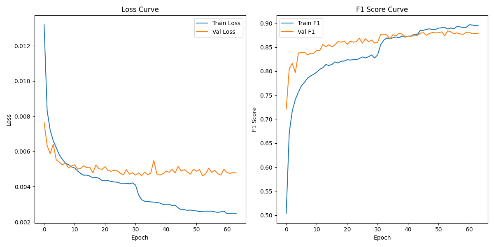

# Yoga Pose Correction - Modelling

We explore 4 machine learning models and compare their performance using a validation set

---

## Data Augmentation

To improve model generalisability and robustness, we augmented the training set by applying the following procedure 3 separate times to each training set pose. These augmentations reflect real-world variations like different camera angles and pose imperfections
- Added small random Gaussian noise (jitter) drawn from a N(0, 0.0001) to all keypoint coordinates
- Rotated the pose around the center by -10 to 10 degrees
 
## Model Performance on Validation Set
- All models were trained on the same training set and evaluated on the same validation set
- A simple baseline Feedforward Neural Network (FFN) was used, with an input layer of 132 features, followed by two hidden layers of 256 and 128 units with ReLU and dropout (probability 0.2). The final output layer maps to 82 classes and softmax is applied to obtain the class probabilities. The model was trained for 30 epochs
- Default model parameters were used for the other 3 models 
- Macro F1 score (which weighs all classes equally) was selected as the evaluation metric as this is a multiclass classification problem with an imbalanced data set
  
  | Model               | Macro F1 Score |
  |---------------------|----------------|
  | Feedforward NN      | 0.8585         |
  | Random Forest       | 0.8333         |
  | XGBoost             | 0.7954         |
  | Logistic Regression | 0.7602         |

- The FFN performed best
- This result suggests that, compared to tree-based methods like Random Forest, the FFN was more effective at capturing the complex, non-linear interactions between various keypoints

## Hyperparameter Tuning 

The Optuna framework was used to optimise the FFN hyperparameters by maximising the macro F1 score on the validation set. The following hyperparameters were tuned with 100 max_epochs and early stopping (patience 10). The best trial returned a macro F1 score of 0.875
  
  | Hyperparameter                         | Range of Values           | Optimal Value |
  |----------------------------------------|---------------------------|---------------|
  | Learning rate                          | Between 1e-5 and 1e-2     | 0.000986      |  
| Scheduler factor                       | [0.1, 0.2, 0.3, 0.4, 0.5] | 0.1           |
| Patience                               | Between 3 and 10          | 7             |
| Batch size                             | [16, 32, 64, 128]         | 128           |
| Dropout rate                           | Between 0.1 and 0.5       | 0.4358        |
| Weight decay                           | Between 1e-5 and 1e-2     | 1.0085        |
| Adam beta1                             | Between 0.8 and 0.99      | 0.9401        |
| Adam beta2                             | Between 0.9 and 0.9999    | 0.9408        |  
| Number of hidden layers                | Between 1 and 5           | 2             |
| Number of dimensions each hidden layer | [64, 128, 256, 512]       | 256, 512      |

We plot the loss and macro F1 score of the best trial. Although the training and validation losses diverge (sign of potential overfitting), the macro F1 score reveals that the model did not overfit the data

