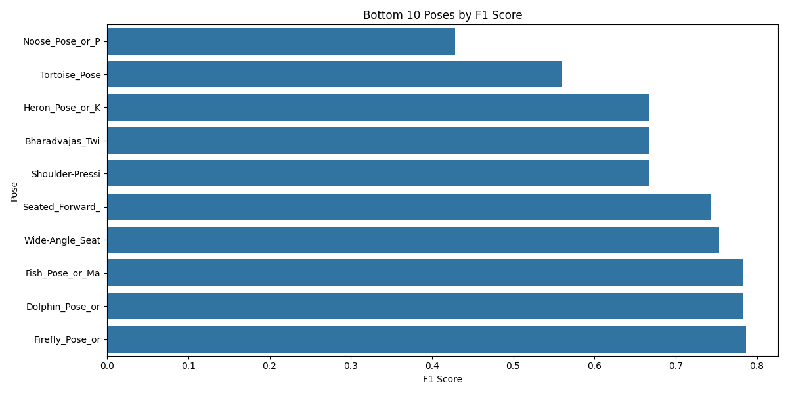
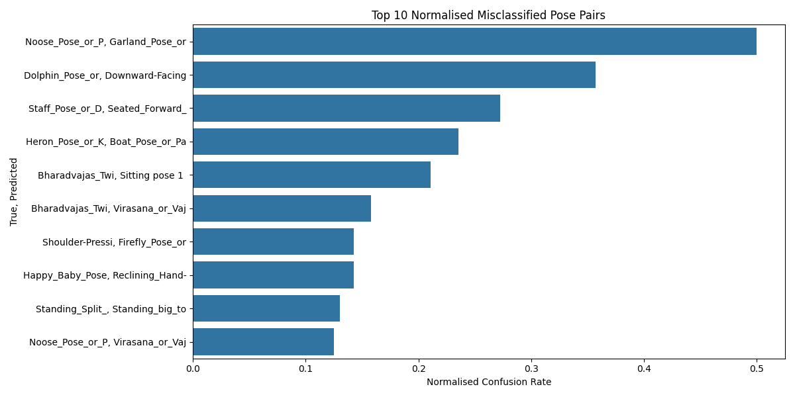

# Yoga Pose Correction - Evaluation

We evaluate the final FFN model on the test set

---

## F1 Scores
- The macro F1 score on the test set = 0.867
- Plotting the 10 lowest F1 scores for individual classes, we found that poses like Tortoise Pose and Noose Pose had the lowest F1 scores

---

## Misclassified Pairs
We analyse the most common (after normalisation) misclassified pairs of poses. The two most common misclassifications are:
- Noose Pose misclassified as Garland Pose
- Heron Pose misclassified as Boat Pose

We plot sample images of the two common misclassifications. We observe that each pair of poses share a large amount of similarities. When certain body landmarks are obscured, one can potentially be misclassified as the other

