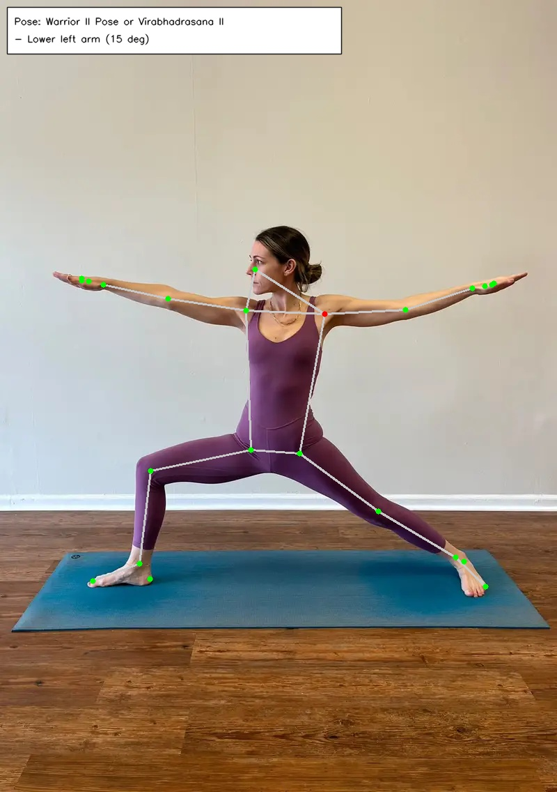

# Yoga Pose Correction - Pose Correction Model

We describe the steps used to build a pose correction model

---

## Handling Pose Asymmetry
- Symmetrical poses appear the same regardless of orientation
- However, asymmetrical poses can be executed with either side of the body (e.g. Warrior II can be performed with either the left leg bent or right leg bent). These require canonicalisation to a consistent side.
- For each pose, identify a suitable rule to detect if a pose is on the canonical side. These rules are largely based on y-axis of keypoints or joint angles as these are more robust to camera angles (all images are upright). Then non-canonical images are flipped by inverted the x-axis coordinates and changing the keypoint labels
    ```
    def is_left_leg_lifted(keypoints):
    return keypoints[25][1] < keypoints[26][1]
    
    def is_left_knee_more_bent(keypoints):
    left_angle = calculate_angle(keypoints[23], keypoints[25], keypoints[27])
    right_angle = calculate_angle(keypoints[24], keypoints[26], keypoints[28])
    return left_angle < right_angle
    
    pose_to_rule = {
        "Warrior_II_Pose_or_Virabhadrasana_II_": is_left_knee_more_bent,
        "Tree_Pose_or_Vrksasana_": is_left_leg_lifted,
        ... 
    }
    ```

## Extracting Target Joint Angles
- Each pose has a manually defined list of key joint angles that are important for assessing correctness. 
    ```
    pose_key_joints = {
        "Warrior_II_Pose_or_Virabhadrasana_II_": ["left_knee", "left_hip", right_knee", "left_shoulder", "right_shoulder", "torso_bend"],
        ...
    }
    ```
- For each pose, key joint angles are extracted (after flipping to the canonical side) and averaged across all images in the data set. These are the target joint angles
    ```
    pose_target_angles = {
        "Warrior_II_Pose_or_Virabhadrasana_II_": {
            'left_shoulder': 101.05,
            'right_shoulder': 90.36,
            'left_hip': 105.55,
            'left_knee': 114.38,
            'right_knee': 175.23,
            'torso_bend': 97.12
        },
        ...
    }
    ```

## Generating Pose Corrections
- During inference, keypoints from an image are normalised (and flipped if non-canonical)
- A classifier is fit to determine the target pose and the observed joint angles are compared against the pose's target joint angles
- Corrections are provided if the difference exceeds a certain threshold (e.g. 10 degrees). Each correction includes the direction (increase/decrease) in natural language and the amount of adjustment needed 
  ```
  {
      'left_knee': 'Bend left knee (12 deg)',
      'left_shoulder': 'Lower left arm (11 deg)'
  }
  ```
  